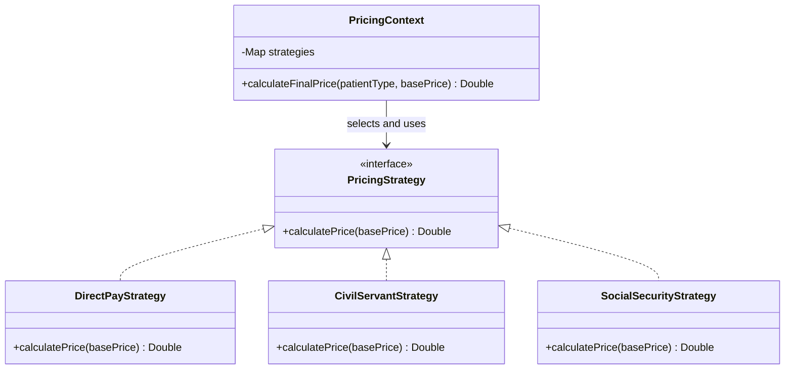

# Design Patterns

โปรเจกต์ Dental Clinic Management System ใช้ Design Patterns เพื่อแยกความรับผิดชอบของระบบ ลดการเชื่อมโยงระหว่างส่วนต่าง ๆ และช่วยให้ดูแลหรือเพิ่มเติมความสามารถของระบบได้ง่ายขึ้น โดยแบ่งเป็น Enterprise / Architectural Patterns และ GoF Design Patterns การเลือกใช้แต่ละรูปแบบพิจารณาจากปัญหาที่เกิดขึ้นจริงในระบบ ไม่ได้เลือกใช้เพียงเพื่อให้ครบตามรายการ

## 1. Enterprise / Architectural Patterns

| Pattern | ปัญหาที่แก้ | ไฟล์/คลาสที่ใช้ | เหตุผลที่เลือกใช้ |
|---|---|---|---|
| Layered Architecture | การรวมหน้าที่ของการแสดงผล Business Logic และการเข้าถึงฐานข้อมูลไว้ด้วยกันทำให้ดูแลยาก | `controller/`, `service/`, `repository/`, `domain/entity/`, `dto/` | แยกหน้าที่ของแต่ละ Layer ให้ชัดเจนและทำให้ปรับปรุงแต่ละส่วนได้ง่ายขึ้น |
| MVC (Model–View–Controller) | การรวมการรับคำขอ การจัดการข้อมูล และการแสดงผลไว้ด้วยกันทำให้โค้ดซับซ้อน | `controller/web/AdminController.java`, Model/Entity classes และ View templates | ช่วยแยกการควบคุมการทำงาน ข้อมูล และหน้าจอออกจากกัน |
| Repository Pattern | Business Logic ต้องเข้าถึงข้อมูลจากฐานข้อมูลโดยไม่ควรจัดการรายละเอียดการเข้าถึงข้อมูลเอง | `AppointmentQueueRepository.java`, `PatientRepository.java`, `DentistRepository.java` | ใช้ Spring Data JPA จัดการการเข้าถึงข้อมูลผ่าน Repository ลดโค้ดที่ต้องเขียนซ้ำ |
| Service Layer Pattern | การเขียน Business Logic ไว้ใน Controller ทำให้การทำงานของระบบกระจายอยู่หลายส่วน | `AppointmentQueueService.java`, `AppointmentQueueServiceImpl.java` และ Service classes อื่น ๆ | รวมขั้นตอนการทำงานทางธุรกิจไว้ใน Service และเปิดให้ Controller เรียกใช้งานผ่านเมธอดที่กำหนด |
| DTO Pattern + Mapper | การใช้ Entity เป็นข้อมูลรับเข้าและส่งออกโดยตรงทำให้โครงสร้างฐานข้อมูลผูกติดกับรูปแบบข้อมูลที่ส่งให้ผู้เรียกใช้ | `QueueBookingRequest.java`, `QueueResponse.java`, `AppointmentQueueMapper.java` | แยก Request/Response ออกจาก Entity และแปลงข้อมูลผ่าน Mapper |
| Dependency Injection (Constructor Injection) | คลาสที่สร้าง Dependency เองจะผูกติดกับการ implement ของคลาสอื่นมากเกินไป | Constructor ของ `AppointmentQueueServiceImpl.java`, `AdminController.java`, `PricingContext.java`, `QueueSubject.java` | ให้ Spring จัดการสร้างและส่ง Dependency ผ่าน Constructor ช่วยให้โค้ดยืดหยุ่นและทดสอบได้ง่ายขึ้น |

## 2. GoF Design Patterns

### 2.1 Strategy Pattern

| Pattern | ปัญหาที่แก้ | ไฟล์/คลาสที่ใช้ | เหตุผลที่เลือกใช้ |
|---|---|---|---|
| Strategy | วิธีคำนวณราคาค่ารักษาแตกต่างกันตามประเภทผู้ป่วย หากรวมทุกวิธีไว้ในเงื่อนไขเดียวจะทำให้แก้ไขและเพิ่มเติมได้ยาก | `PricingStrategy.java`, `DirectPayStrategy.java`, `CivilServantStrategy.java`, `SocialSecurityStrategy.java`, `PricingContext.java` | แยกวิธีคำนวณราคาแต่ละประเภทเป็น Strategy ทำให้เลือกใช้วิธีที่เหมาะสมได้ และเพิ่มวิธีคำนวณใหม่ได้โดยลดการแก้ไขโค้ดส่วนอื่น |

Class Diagram:

### 2.2 Observer Pattern

| Pattern | ปัญหาที่แก้ | ไฟล์/คลาสที่ใช้ | เหตุผลที่เลือกใช้ |
|---|---|---|---|
| Observer | เมื่อระบบสร้างคิวหรือต้องแจ้งการเปลี่ยนแปลงสถานะคิว ไม่ควรรวมการทำงานของผู้รับการแจ้งเตือนทั้งหมดไว้ใน Service | `QueueObserver.java`, `QueueSubject.java`, `AppointmentQueueServiceImpl.java` และคลาสที่ implement `QueueObserver` | ให้ `QueueSubject` แจ้ง Observer ที่ลงทะเบียนไว้ ช่วยแยกการแจ้งเตือนออกจากขั้นตอนหลักของการจัดการคิว |

